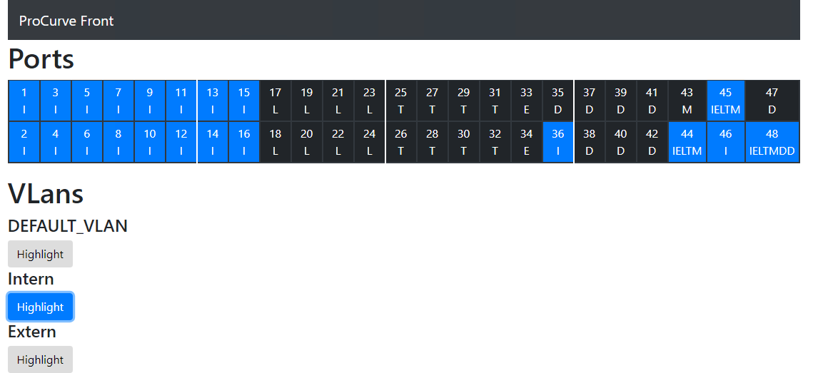

# ProCurve Front
Backup and VLan visualization for ProCurve 2510G-48.

This project tries to solves two problems:
- Create a backup of the switch configuration with one command
- Visualize which ports are assigned to which vlans

This project consists of two different parts:
- Python backend for accessing the switch data
- VueJS frontend 




## Backend
### Usage
Copy `config.sample.json` to `config.json` and adjust as required.

To run a backup execute the following command
```bash
python3 Backup.py
```

The additional json file output is used for the visualization.
Make sure the json output path is configured to be placed in `<webroot>/static/portConfig.json`


## Frontend
Copy the  files found in `frontend/dist/` to your web root.

If you want to compile the frontend for your self:
```bash
npm run build
```
